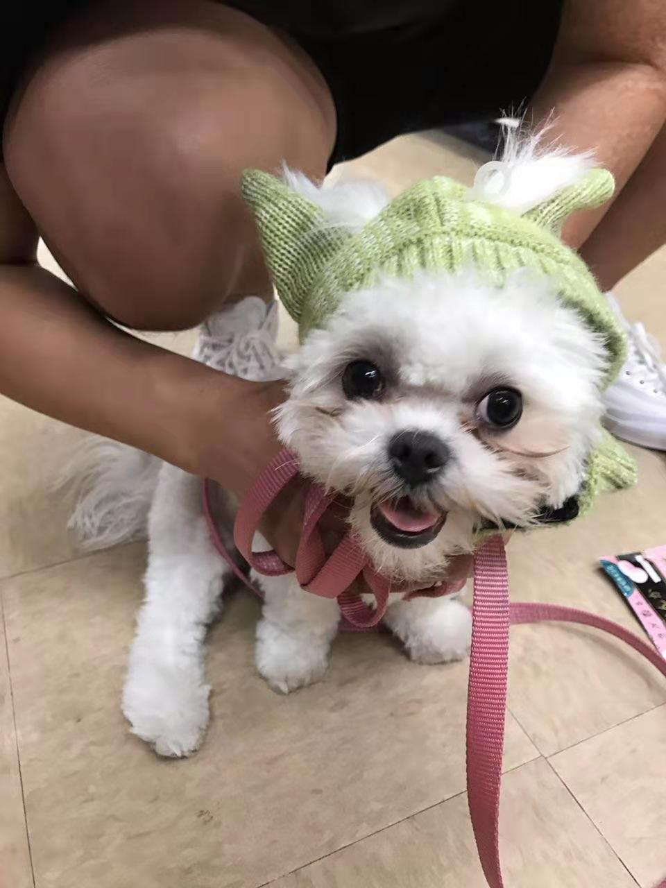
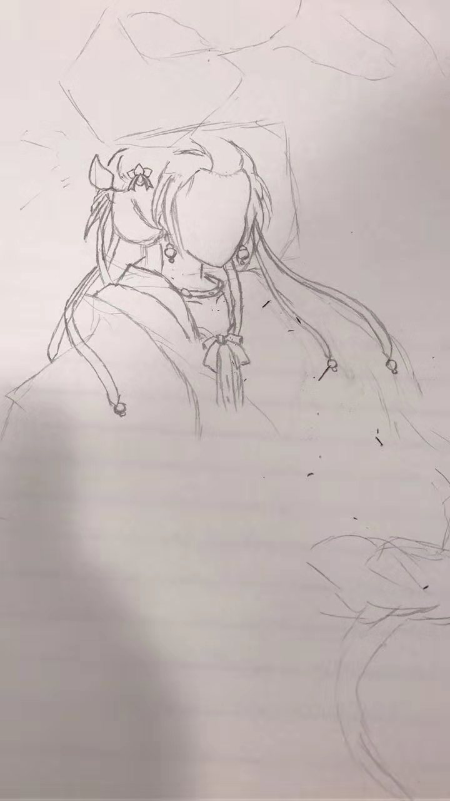
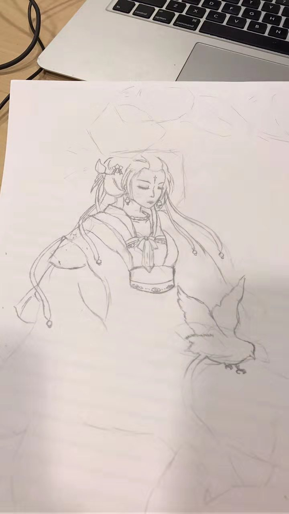

## Welcome!

Here you've reached **Jingyi Tang's personal website**, congratutions!

## Here's **the star** of Jingyi's page:
    
The most-loved and must-love puppy - **Mochi**!

## Here's something Jingyi likes to do:

Half-finished doddles:

But this is more me:

OK, I always change to something more legit:

## Helpful External Links:

If you are interested in instituitions that Jingyi has attended, refer to the official websites of [University of Iowa](https://uiowa.edu/) and [Columbia University](https://www.columbia.edu/)!

You can find almost everything you need on [Google.com](https://www.google.com/)!

